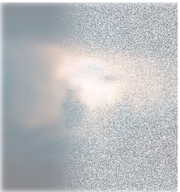

# Responsive Design

## 2019/6/21

响应式卡片


```css
/* 图片使用绝对定位 */
/* 使用odd 和 even 调整图片的位置 */
.container .box:nth-child(odd) .thumb {
  bottom: 0;
}
.container .box:nth-child(even) .details {
  bottom: 0;
}
```

### 响应式部分

```css
@media (max-width: 1000px) {
  .container {
    width: 100%;
    height: auto;
    padding: 20px;
    box-sizing: border-box;
  }
  .container .box {
    height: 250px;
  }
}
```


```css
@media (max-width: 768px) {
  .container {
    flex-wrap: wrap;
  }

  .container .box {
    flex-basis: 50%;
    transition: transform 1s;
  }
}
```


```css
@media (max-width: 500px) {
  .container .box {
    flex-basis: 100%;
  }
}
```


# CSS 3d Layered Image
## 2019/6/19

鼠标 hover 出现特效

```css
/* 使用skew产生形变 */
transform: rotate(-30deg) skew(25deg) scale(0.8);
/* 添加4层layer，分别在hover的时候tranform就行了 */
```

```html


```

```css
/* 每一张图片transform不同距离 */
/* 给上不同透明度 */
.container:hover img:nth-child(4) {
  transform: translate(160px, -160px);
  opacity: 1;
}

.container:hover img:nth-child(3) {
  transform: translate(120px, -120px);
  opacity: 0.8;
}

.container:hover img:nth-child(2) {
  transform: translate(80px, -80px);
  opacity: 0.6;
}

.container:hover img:nth-child(1) {
  transform: translate(40px, -40px);
  opacity: 0.4;
}
```


# Thanos Snap Disperison

## 2019/6/18

灭霸响指消失特效（有点 low）

```css
/* 原理就是使用一张noise.png的噪点图覆盖原图 */
```


