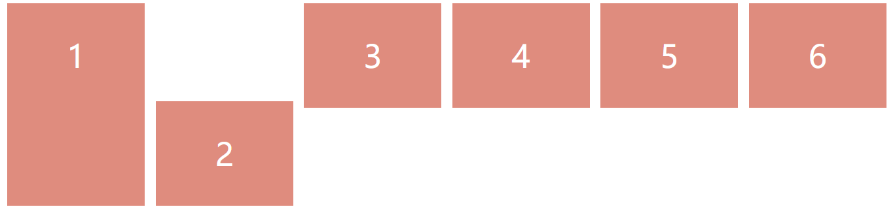
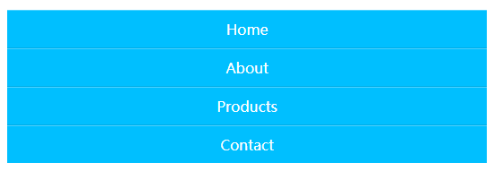
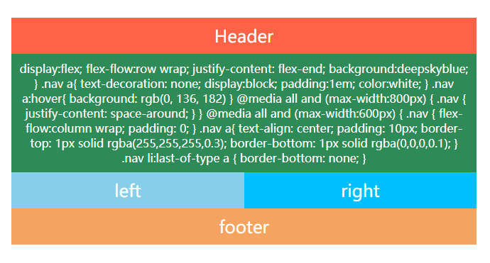

# 8 Horizontal Menu
## 2019/6/23
### 水平菜单栏
有一些简单的动画，在别的地方看见的，就照着做了下
```css
/* 主要也是用的 :before 伪元素来修饰图标 */
nav .menu ul li:hover i:before {
  border-color: transparent;
  border-radius: 500px;
  width: 66px;
  height: 66px;
  line-height: 60px;
  transition: color 0.2s linear 0s, font-size 0.2s linear 0s,
    border-color 0.2s linear 0s, height 0.2s linear 0s,
    width 0.2s linear 0s, line-height 0.2s linear 0s;
}
nav .menu a i:before {
  border: 2px solid;
  border-color: #a3a7ad;
  border-radius: 500px;
  width: 41px;
  display: inline-block;
  height: 41px;
  line-height: 37px;
  transition: color 0.2s linear 0s, font-size 0.2s linear 0s,
    border-color 0.2s linear 0.2s, height 0.2s linear 0s,
    width 0.2s linear 0s, line-height 0.2s linear 0s;
}
```


# 7 Responsive Design
## 2019/6/21

响应式卡片


```css
/* 图片使用绝对定位 */
/* 使用odd 和 even 调整图片的位置 */
.container .box:nth-child(odd) .thumb {
  bottom: 0;
}
.container .box:nth-child(even) .details {
  bottom: 0;
}
```

### 响应式部分

```css
@media (max-width: 1000px) {
  .container {
    width: 100%;
    height: auto;
    padding: 20px;
    box-sizing: border-box;
  }
  .container .box {
    height: 250px;
  }
}
```


```css
@media (max-width: 768px) {
  .container {
    flex-wrap: wrap;
  }

  .container .box {
    flex-basis: 50%;
    transition: transform 1s;
  }
}
```


```css
@media (max-width: 500px) {
  .container .box {
    flex-basis: 100%;
  }
}
```


# 6 CSS 3d Layered Image
## 2019/6/19

鼠标 hover 出现特效

```css
/* 使用skew产生形变 */
transform: rotate(-30deg) skew(25deg) scale(0.8);
/* 添加4层layer，分别在hover的时候tranform就行了 */
```

```html


```

```css
/* 每一张图片transform不同距离 */
/* 给上不同透明度 */
.container:hover img:nth-child(4) {
  transform: translate(160px, -160px);
  opacity: 1;
}

.container:hover img:nth-child(3) {
  transform: translate(120px, -120px);
  opacity: 0.8;
}

.container:hover img:nth-child(2) {
  transform: translate(80px, -80px);
  opacity: 0.6;
}

.container:hover img:nth-child(1) {
  transform: translate(40px, -40px);
  opacity: 0.4;
}
```


# 5 Thanos Snap Disperison
## 2019/6/18

灭霸响指消失特效（有点 low）

```css
/* 原理就是使用一张noise.png的噪点图覆盖原图 */
```


# 4 Hover expand menn
## 2019/6/10

简单的菜单栏
> 使用:target伪类来实现点击、未使用js
```css
/* 
 * target为地址栏中的hash
 * 该用法能够使.item id=hash值的元素被选中
 * 然后使他的高度为10em
*/
.item:target .submenu {
  max-height: 10em;
  /* overflow: scroll; */
}
```


# 1-3 flex布局简单尝试
## 2019/5/30
### flex布局1   
```css
/*
 * flex中居中的方法
 */
.container {
  display: flex;
  justify-content: center; /* 在轴的方向上使元素居中 */
  align-items: center;     /* 垂直于flex轴居中 */
  align-content: center;   /* 设置了flex-wrap后，使得每一行居中于该行*/
}
/*
 * 注意 align-self 与 align-items 的取别
 * align-self用于容器中的元素
 * align-items用于容器
 */

```


### flex布局2


### flex布局3


# 0 Glowing Border
# 渐变色的边框
## 2019/5/25
### 该方法的巧妙之处是使用了为元素:after和:before来添加边框

```css
.container:before {
  content: '';
  position: absolute;
  top: -2px;
  left: -2px;
  right: -2px;
  bottom: -2px;
  background-color: white;
  z-index: -1;
}

.container:after {
  content: '';
  position: absolute;
  top: -2px;
  left: -2px;
  right: -2px;
  bottom: -2px;
  background-color: white;
  z-index: -1;
  filter: blur(15px);
}
.container:before,
.container:after {
  background: linear-gradient(235deg, #d4ffa2, #f956ff, #6aeeff);
}
```


